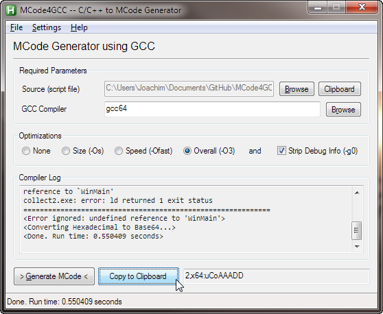

MCode4GCC
==================
  
MCode4GCC is an MCode generator using the GCC Compiler.  
More about MCode here : http://ahkscript.org/boards/viewtopic.php?f=7&t=32
  
## Screenshots

  
## Help
- [What is MCode?](#what-is-mcode)
- [Getting started](#getting-started)
- [Setting up GCC](#setting-up-gcc)
- [Questions?](#questions)
	
#### What is MCode?
**MCode** is short for [machine code](http://en.wikipedia.org/wiki/Machine_code). Basically, it is compiled code : instructions in binary form for the CPU to execute. The main advantages of MCode is speed and the possibility to execute low-level code, such as Assembly.  

#### Getting started
Currently, there are two MCode functions available for AutoHotkey. Bentschi's version is recommended.  
  
**Laszlo**'s version :  
How to use it : http://www.autohotkey.com/board/topic/19483-machine-code-functions-bit-wizardry
```
MCode(ByRef code, hex) { ; allocate memory and write Machine Code there
	VarSetCapacity(code,StrLen(hex)//2)
	Loop % StrLen(hex)//2
		NumPut("0x" . SubStr(hex,2*A_Index-1,2), code, A_Index-1, "Char")
}
```
  
**Bentschi**'s version :  
How to use it : http://ahkscript.org/boards/viewtopic.php?f=7&t=32
```
MCode(mcode) {
	static e := {1:4, 2:1}, c := (A_PtrSize=8) ? "x64" : "x86"
	if (!regexmatch(mcode, "^([0-9]+),(" c ":|.*?," c ":)([^,]+)", m))
		return
	if (!DllCall("crypt32\CryptStringToBinary", "str", m3, "uint", 0, "uint", e[m1], "ptr", 0, "uint*", s, "ptr", 0, "ptr", 0))
		return
	p := DllCall("GlobalAlloc", "uint", 0, "ptr", s, "ptr")
	if (c="x64")
		DllCall("VirtualProtect", "ptr", p, "ptr", s, "uint", 0x40, "uint*", op)
	if (DllCall("crypt32\CryptStringToBinary", "str", m3, "uint", 0, "uint", e[m1], "ptr", p, "uint*", s, "ptr", 0, "ptr", 0))
		return p
	DllCall("GlobalFree", "ptr", p)
}
```
  
#### Setting up GCC
There are many GCC distributions for the Microsoft Windows Operating System.  
Here are some recommended ones :  
	- MinGW : http://www.mingw.org/wiki/Getting_Started  
	- TDM-GCC : http://tdm-gcc.tdragon.net/download  
	- Cygwin : https://cygwin.com/install.html  
  
#### Questions?
Don't be shy to post in the forums. Just ask away!  
Post your questions here : http://ahkscript.org/boards/viewforum.php?f=5  
  
## Credits
Special thanks to IsNull, fincs, Laszlo, SKAN, Bentschi and kon  
Written by joedf (joedf@ahkscript.org)  
Released under the [MIT License](http://opensource.org/licenses/MIT)  
